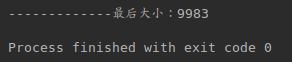

# ArrayList在并发下的问题分析

## 1.并发导致数据丢失
>10000个并发同时写ArrayList，导致部分数据丢失。如：
* 源码
```Java
testWriteArrayListError()
```


* 原因分析


并发下的ArrayList错误分析
https://blog.csdn.net/lan861698789/article/details/81697409
## ConcurrentModificationException
Java并发编程：同步容器、并发容器和阻塞队列
https://blog.csdn.net/qq_20176495/article/details/74129727
如何线程安全地遍历List：Vector、CopyOnWriteArrayList
https://www.cnblogs.com/wucao/p/5350461.html
Java迭代器（转）(iterator详解以及和for循环的区别)
https://www.cnblogs.com/redcoatjk/articles/4863340.html
Java ConcurrentModificationException异常原因和解决方法
https://www.cnblogs.com/dolphin0520/p/3933551.html
Java并发编程：并发容器之CopyOnWriteArrayList（转载）
https://www.cnblogs.com/dolphin0520/p/3938914.html
ArrayList并发问题分析
https://blog.csdn.net/xiaoe3504xiaoe/article/details/80747659
